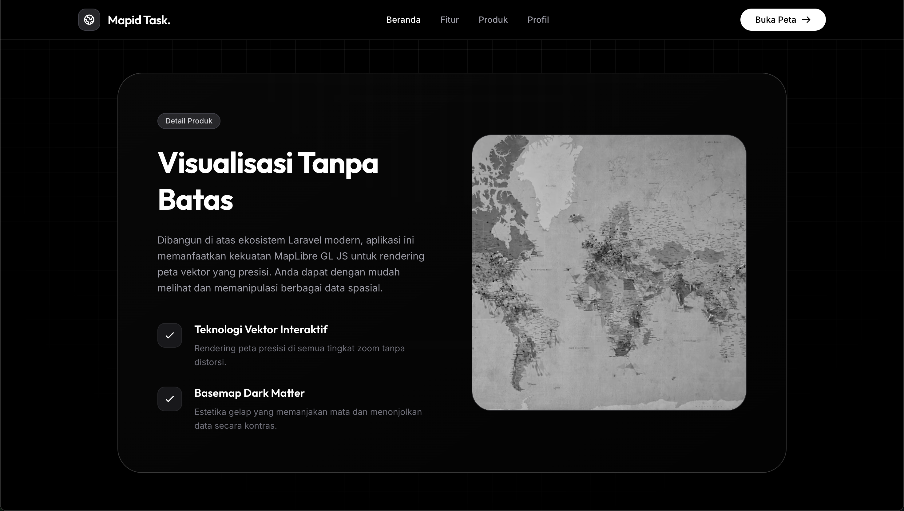
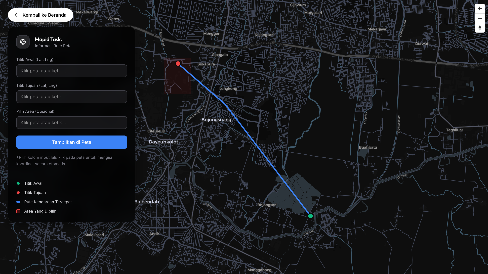

# 🌍 Task Test Case

Mapid Task adalah sebuah aplikasi web sederhana berbasis **Laravel** dan **Tailwind CSS** yang dirancang sebagai portofolio profesional dan demonstrasi Sistem Informasi Geografis (Web GIS). Aplikasi ini menampilkan antarmuka yang sangat responsif, optimal untuk SEO, dan terintegrasi dengan peta interaktif modern untuk kebutuhan Task Test Case saya Intern di Mapid.

## 🌐 Live Deployment (Submission)

Aplikasi ini telah di-deploy dan dapat diakses secara publik oleh tim rekrutmen melalui tautan berikut:
👉 **[https://mapid-task.up.railway.app/](https://mapid-task.up.railway.app/)**

---

## ✨ Fitur Utama

- **Desain Developer-Centric**: Antarmuka modern dengan tema gelap (Dark Mode), efek *glassmorphism*, dan pola grid yang rapi, dibangun seutuhnya menggunakan Tailwind CSS.
- **Peta Interaktif Berkinerja Tinggi**: Memanfaatkan **MapLibre GL JS** untuk me-render data vektor secara cepat dan mulus di sisi *client*.
- **Visualisasi Data Spasial**: Menampilkan manipulasi layer peta menggunakan data dummy GeoJSON berupa Titik (*Marker/Point*), Garis Rute (*LineString*), dan Zona Area Berbayang (*Polygon*).
- **Basemap Open-Source**: Menggunakan gaya peta *CartoDB Dark Matter* berbasis OpenStreetMap (OSM) tanpa bergantung pada API key berbayar.
- **Responsif & Mobile-Friendly**: Tampilan disesuaikan sempurna untuk seluruh ukuran layar (mencegah *overscroll* pada halaman peta).

## 🗺️ Panduan Penggunaan Peta Dinamis

Aplikasi ini dilengkapi dengan fitur _Routing_ kendaraan interaktif dan pembuatan poligon dinamis menggunakan integrasi OSRM dan Nominatim Geocoding API. Berikut adalah cara penggunaannya:

1. Buka halaman **Live Map Data**.
2. **Menentukan Titik Lokasi:** Anda dapat menentukan Titik Awal, Titik Tujuan, maupun Titik Pusat Area Merah dengan dua cara yang sangat fleksibel:
   - **Metode Point-and-Click:** Klik pada salah satu kolom input (misal: Titik Awal) agar fokus, lalu **klik di mana saja pada peta**. Koordinat presisi `(Lat, Lng)` akan langsung terisi secara otomatis.
   - **Metode Pencarian Teks (Geocoding):** Anda tidak perlu pusing memikirkan koordinat! Cukup **ketikkan nama tempat** di dalam kolom input (contoh: `"Jakarta"`, `"Gedung Sate"`, atau `"Mie Gacoan Buah Batu"`). Sistem pintar kami akan melacak dan mencari lokasi tersebut secara otomatis.
3. **Kalkulasi Rute:** Setelah Titik Awal dan Titik Tujuan terisi, klik tombol **"Tampilkan di Peta"**. Sistem akan menarik data dari API OSRM untuk menggambar jalur nyata terpendek untuk kendaraan roda empat di atas peta.
4. **Area Poligon Kustom:** Jika Anda mengisi input _Pusat Area Merah (Opsional)_, sistem akan langsung menggambar zona merah berukuran ~1km x 1km tepat di titik yang Anda pilih (sebagai demonstrasi dari manipulasi layer GeoJSON dinamis).
5. **Analisis Hasil:** Tinjau jarak tempuh akurat dan estimasi waktu berkendara pada jendela _pop-up_ ringkas di sudut kanan atas layar.

## 📸 Demo Antarmuka (UI)

### Halaman Beranda (Landing Page)


### Section Tentang (Default Load)


### Halaman Peta (Hasil Routing Dinamis)


---

## 🛠️ Tech Stack

- **Framework**: Laravel 
- **Styling**: Tailwind CSS (melalui Laravel Vite)
- **Mapping Library**: MapLibre GL JS (Vanilla JS)

---

## 🚀 Cara Menjalankan di Local (Development)

Proyek ini dapat dijalankan dengan mudah menggunakan *built-in server* PHP (`php artisan serve`) secara universal, maupun menggunakan **Laravel Valet** untuk pengguna macOS.

### Prasyarat
- PHP 8.2+
- Composer
- Node.js & NPM

### Langkah Instalasi Dasar (Wajib)

1. **Buka Terminal di Direktori Proyek**
   Masuk ke dalam direktori aplikasi ini:
   ```bash
   cd geospatial-app
   ```

2. **Install Dependensi Back-end (Composer)**
   ```bash
   composer install
   ```

3. **Konfigurasi Environment**
   Salin *file* environment dan *generate app key*:
   ```bash
   cp .env.example .env
   php artisan key:generate
   ```

4. **Install Dependensi Front-end & Build (NPM)**
   Install semua modul Node dan kompilasi *asset* Tailwind CSS (diperlukan agar UI tidak berantakan):
   ```bash
   npm install
   npm run build
   ```

*(Catatan: Anda juga bisa menjalankan `npm run dev` pada tab terminal terpisah jika ingin melihat perubahan desain UI secara langsung / Hot Module Replacement).*

---

### Opsi 1: Menggunakan `php artisan serve` (Universal)

Cara paling standar dan direkomendasikan untuk menjalankan aplikasi Laravel di lingkungan lokal apa pun (Windows, Linux, macOS).

1. Jalankan perintah berikut di terminal Anda:
   ```bash
   php artisan serve
   ```

2. Aplikasi Anda sekarang berjalan. Buka *browser* dan akses:
   👉 **http://localhost:8000**

---

### Opsi 2: Menggunakan Laravel Valet (Khusus macOS)

Bagi Anda yang sudah menginstal dan menjalankan Laravel Valet di perangkat Mac.

1. Tautkan proyek ini ke Valet dengan perintah:
   ```bash
   valet link geospatial-app
   ```

   *(Jika folder induk proyek ini sudah menggunakan `valet park`, Anda dapat melewati langkah ini).*
2. Setelah berhasil dihubungkan, buka *browser* dan akses:
   👉 **http://geospatial-app.test**
